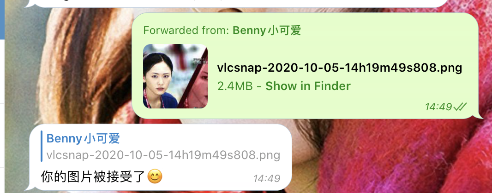

# DailyGakki
😚 每日分享最可爱的Gakki
Telegram Bot🤖️

[新垣結衣の写真](https://t.me/my_gakki_bot)

## command
```
new - 再来一张
about - 新垣结衣是谁
start - ガッキー
settings - 设置
subscribe - 订阅图片推送
unsubscribe - 取消图片推送
status - 查看订阅状态
submit - 提交图片
ping - 运行状态
```

# 部署方式 - 常规方式
1. 准备图片，如`/home/DailyGakki/photos/`
2. 安装golang和make，如 `apt install golang-go make`
3. `git clone https://github.com/BennyThink/DailyGakki`
4. `make`
5. `TOKEN="1082Go" PHOTOS="/home/DailyGakki/photos/" /home/DailyGakki/DailyGakki`
可以了！ 如果需要支持用户投稿功能，需要增加 `REVIEWER`环境变量

更多信息可以参考`Makefile`和`daily-gakki.service`

# 部署方式 - docker

```shell script
docker run -d --restart=always -e TOKEN="FXI" -e PHOTOS="/photos/"  -e REVIEWER="123" \
-v local/photo/path/:/photos -v database.json:/database.json
bennythink/dailygakki
```

# 使用截图

## 聊天

使用 `/subscribe`命令订阅，bot会在每晚18:11推送图片


## inline模式

在任意聊天框中，输入 `@my_gakki_bot` 即可！


## 提交图片

直接发送（转发）图片/文件给机器人即可！



## 设置

自由选择推送时间，群组中只有管理员和群主可以设置


# Plan

- [x] Dockerfile
- [x] 用户投稿和review
- [x] 设置

# 其他信息

* [Google Photos](https://photos.app.goo.gl/2aLeoBiRypWRR8yY9)
* [ガッキー | 新垣結衣](https://gakki.photos/)

# License

Apache License Version 2.0
